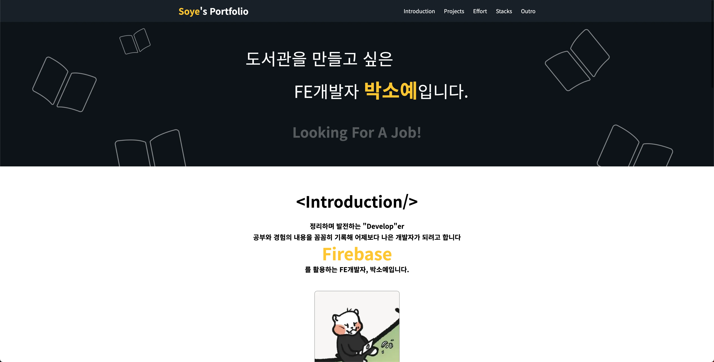
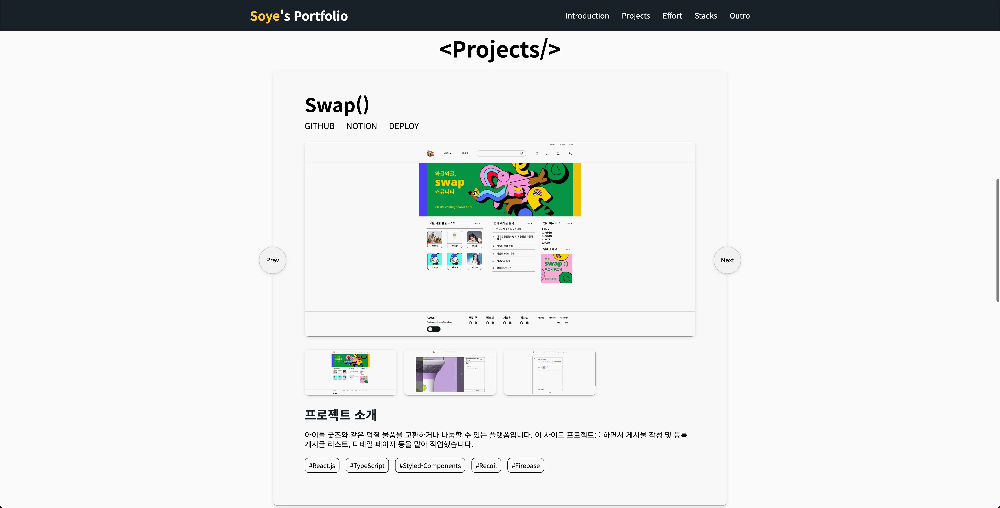

# Soye's Portfolio

배포링크 : https://soye-portfolio.vercel.app/

## 간단 소개

> 안녕하세요. FE개발자 박소예입니다. <br/>
> 해당 사이트는 저에 대한 간단한 소개와 프로젝트 등을 소개한 포트폴리오 사이트입니다.<br/>
> React로 구현된 SPA 사이트이며 스타일드 컴포넌트를 활용해 스타일링 하였습니다.

---

## 실행 방법

```js
$ npm run start
$ yarn start
```

---

## 사용스택

React.js, Styled-components

---

## 페이지 소개

### 메인페이지



1. 상단 Nav바를 통해 원하는 카테고리로 이동할 수 있습니다.
2. useInterval hook을 활용하여 사용스택을 1초마다 바꿔 보여주도록 했습니다.

---

### 프로젝트 소개 페이지



1. prev, next 버튼을 통해 프로젝트를 전환할 수 있습니다. useState를 활용해 배열로 만들어둔 프로젝트 정보를 불러들이는 형태로 작업했습니다.
2. useState만 활용 시 사진이 업데이트가 되지 않는 문제가 발생하는데 useEffect를 활용해 cardIndex 가 변할 때마다 사진도 업데이트 될 수 있도록 하였습니다.
3. 또한 프리뷰 이미지 하단의 작은 이미지를 클릭할 때마다 프리뷰 이미지가 변경될 수 있도록 하였습니다.

---

### 반응형 (모바일, 태블릿) 적용


1. 모바일과 태블릿 사이즈에도 대응할 수 있도록 스타일링 하였습니다.
2. 스크린 사이즈에 따라 카드 디자인을 해체하는 등의 디자인을 넣었습니다.
